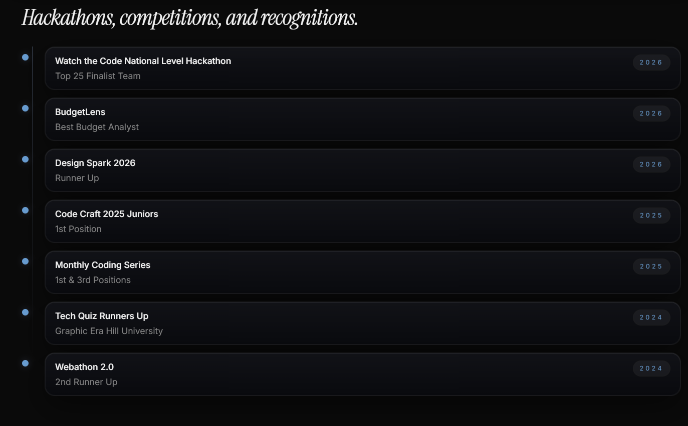

# Profile — Priyanshu Bisht (Dream with Priyanshu)

## Identity

- **Full name:** Priyanshu Bisht
- **Brand:** Dream with Priyanshu
- **Role:** Frontend Developer & Builder

## Contact

- **Email:** justfreewithme@gmail.com
- **LinkedIn:** linkedin.com/in/dream-with-priyanshu
- **GitHub:** github.com/dreamwithpriyanshu

## Positioning

- **Eyebrow:** FRONTEND DEVELOPER & BUILDER
- **Tagline:** I build interfaces, explore data, and learn every day — turning ideas into useful, well-crafted products on the web.
- **Philosophy:** Ship fast, learn faster, Carpe Diem
- **Open to:** Internships, Collaborations, Open-source contributions
- **Status:** Currently building & learning

## Bio
make by ur own 
## Education

| Period | Institution | Detail |
|---|---|---|
| 2024 – 2027 | Graphic Era Hill University | Bachelor of Computer Application (BCA), AI & Data Science. CGPA: 9.43 |
| 2022 – 2024 | Jaycees Public School | Intermediate (Senior Secondary), Score: 86% |

## Experience

- **Chief Technology Officer** — loopynow (self-employed, remote), Jun 2026 – Jul 2026. Site: loopynow.shop. Focus: project management, team management.

## Tech stack

| Category | Items |
|---|---|
| Frontend | React, , JavaScript, HTML5, CSS3, 
| Backend | Node.js, 
| Languages | Python, Java, C |
| Tools & Workflow | Git, GitHub, VS Code

## Journey / timeline

- **2026 – Present — Frontend Developer & Builder** *(Personal Projects & Open Source)*
  
  - Exploring data analytics workflows and visualization tools.
  - learning frontend modern technologies
  
- **2024-2027— Learning & Building** *(Graphic Era Hill University, BCA)*
 

## Projects

None yet — dont' add any 

## Assets

- **Résumé:** resume.pdf
- **Hero avatar:** animated-image.png (anime-style)

## Footer copy

Built with care by Priyanshu Bisht
Dream with Priyanshu © 2026

## Domain

Free .netlify.app subdomain